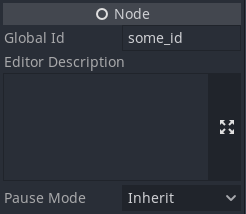

# godot-global-node-ids-plugin

This plugin adds the Global Id field and the GlobalNodes singleton.

## Note

This plugin was created as a POC of opportunity to create such a plugin for those who wish to have this feature in Godot. I have not tested this plugin properly and generally do not recommend using this approach.

See [godotengine/godot-proposals#2812](https://github.com/godotengine/godot-proposals/issues/2812) and [godotengine/godot-proposals#3056](https://github.com/godotengine/godot-proposals/issues/3056).
